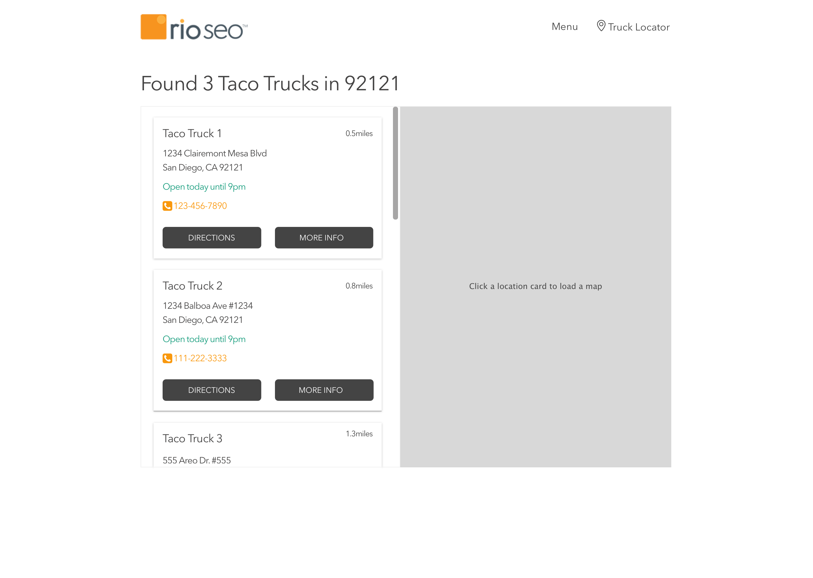
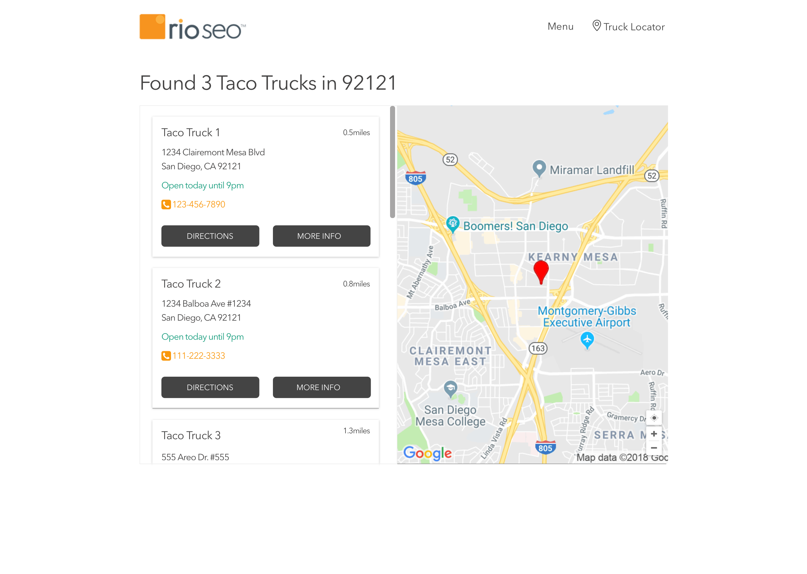
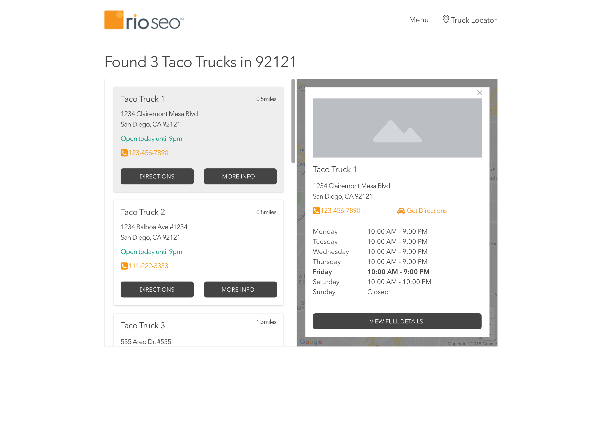
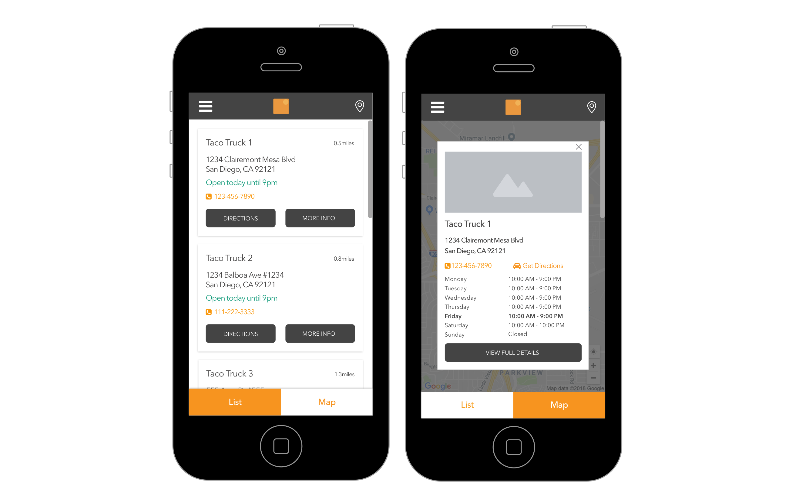

## Taco Truck Locator – Solution

This project is my implementation of the Taco Truck Locator code assessment.

The application fetches taco truck location data from the provided API, filters locations by postal code, calculates distance from a simulated user location, and renders an interactive list with map integration and extended location details. The interface is fully responsive and follows the provided desktop and mobile mocks.

### Features

- Asynchronous API call using jQuery ($.ajax)
- Distance calculation using the Haversine formula
- Sorted results by distance (nearest first)
- Interactive location cards
- Static Google Maps rendering based on latitude/longitude

##### Modal overlay with:

- Full weekly opening hours
- "View Full Details" external link
- "Directions" link to Google Maps
- Responsive layout (desktop split view + mobile toggle view)
- Basic loading and error handling states

### Tech Stack

- HTML5
- CSS3
- Bootstrap 5
- JavaScript (jQuery)
- Google Static Maps API

### How to Run

1. Clone or download the repository.
2. Open index.html in your browser.
3. No build tools or server setup required.

OR 

You can view live demo here:

https://sanjamehic.github.io/code-assessment/


### Notes

A fixed user latitude/longitude is used to simulate distance calculation.

A sample postal code filter is applied to match the mock requirement.

The Google Maps API key is included for demo purposes. In a production environment, this should be secured server-side.


## Taco Truck Locator Code Assessment

Taco Truck Co. would like a simple truck locator to be created. This locator will show the businesses where the taco trucks are parked in front of.

You are given an API call that provides you with this location data in JSON format. The API call will respond to GET requests to the following URL: https://my.api.mockaroo.com/locations.json?key=fcd8edc0

Here is a single locations sample data:
```json
{
    "id": 1,
    "name": "Schmeler Inc",
    "url": "http://mapy.cz/quam/sapien/varius/ut.jsp",
    "address": "742 Bashford Court",
    "city": "Fort Wayne",
    "state": "IN",
    "postal_code": "46862",
    "latitude": "41.0938",
    "longitude": "-85.0707",
    "monday_open": "9:41 AM",
    "monday_close": "4:42 PM",
    "tuesday_open": "9:08 AM",
    "tuesday_close": "9:49 PM",
    "wednesday_open": "6:56 AM",
    "wednesday_close": "5:15 PM",
    "thursday_open": "9:57 AM",
    "thursday_close": "8:10 PM",
    "friday_open": "6:43 AM",
    "friday_close": "5:31 PM",
    "saturday_open": "6:45 AM",
    "saturday_close": "4:43 PM",
    "sunday_open": "8:14 AM",
    "sunday_close": "4:05 PM"
}
```

__The final project should look similar these mocks:__ 
1. Initial load screen will present a list of locations.


2. When you click or tap on a location address card from the list, a static map with that location latitude and longitude should be asyncronously rendered.


3. When you click or tap the "MORE INFO" button, an overlay with extended location data will load asyncronosly.


4. From the overlay, the "VIEW FULL DETAILS" should open the location's url in a new window.

5. When you click or tap "DIRECTIONS", open Google Maps in a new window with the locations address populated as the end point for the route.

6. The website should be responsive such that the mobile interface looks like the following mocks.
